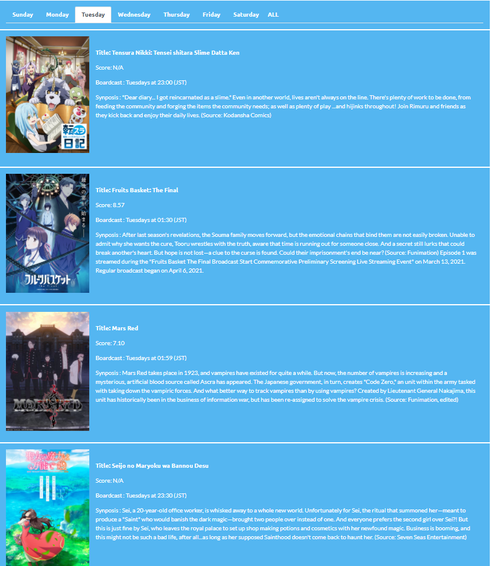

# DailyAnime
Seasonal Anime's broadcast days

# Purpose 

Website that categorizes the current seasonal Anime by the day that they broadcast. This project was to help me learn about web-scraping, nodejs to update local files, and bootstrap5 for css. In this project I webscraped from the website MyAnimeList to receive the data.

# Status

The site is currently not deployed!

# Sample Images of Site

## Sunday Tab

## Tuesday Tab

## Tab that is zoomed out

